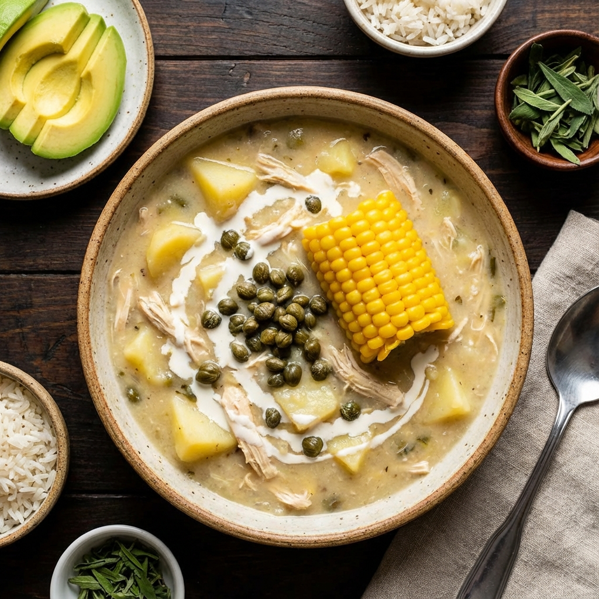
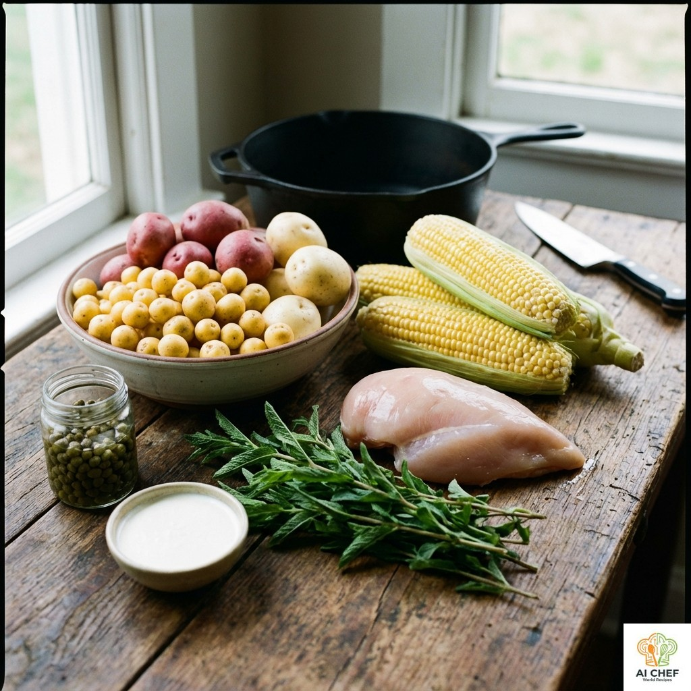

## 📝 Ingredientes

* **Para la sopa:**
    * 2 pechugas de pollo grandes
    * 1 kg de papa criolla (amarilla), pelada
    * 1 kg de papa pastusa (blanca), pelada y en rodajas
    * 1 kg de papa sabanera, pelada y en rodajas
    * 4 mazorcas de maíz tierno, partidas en trozos
    * 1 manojo grande de guascas frescas
    * Sal y pimienta al gusto

* **Para servir:**
    * Crema de leche
    * Alcaparras en vinagre
    * Aguacate en rodajas
    * Arroz blanco (opcional)

---

## 👨‍🍳 Instrucciones

1. **Cocción del Pollo:** En una olla grande, cocina las pechugas de pollo en agua con sal hasta que estén tiernas. Retira el pollo, desméchalo y reserva el caldo.
2. **Preparación de la Sopa:** En el mismo caldo, agrega las papas pastusa y sabanera, las mazorcas y la mitad de las guascas. Cocina a fuego medio.
3. **Añadir Papa Criolla:** Cuando las papas empiecen a ablandarse, añade la papa criolla. Esta se deshará y le dará el espesor característico al ajiaco.
4. **Incorporar Guascas:** Unos 10 minutos antes de terminar la cocción, añade el resto de las guascas para que suelten todo su aroma.
5. **Finalizar:** Agrega el pollo desmechado a la sopa, rectifica la sal y la pimienta, y deja que todo se integre por unos minutos.
6. **Servir:** Sirve el ajiaco bien caliente. Cada comensal puede añadir a su gusto crema de leche, alcaparras y acompañar con aguacate.

---

## 💡 Variaciones y Consejos

* **El secreto está en las papas:** La combinación de las tres papas es esencial. La criolla espesa, mientras que la pastusa y la sabanera aportan textura.
* **Guascas frescas:** Utiliza siempre guascas frescas. Son el alma del ajiaco y su sabor no tiene sustituto.
* **Acompañamiento:** Tradicionalmente se sirve con una porción de arroz blanco para mezclar con la sopa.
* **Sabor auténtico:** Para lograr un sabor auténtico, es importante utilizar guascas frescas y de buena calidad. Según el chef Juan Carlos Vargas, del restaurante "La Macarena" en Bogotá, "las guascas frescas son el secreto para un ajiaco sabroso y aromático" [1].
* **Técnica de cocción:** La técnica de cocción es fundamental para lograr un ajiaco cremoso y delicioso. Según la chef María Elvira Velasco, del restaurante "El Cielo" en Bogotá, "es importante cocinar las papas a fuego medio para que se ablanden y se deshagan correctamente" [2].
* **Consejos para servir:** Para servir el ajiaco de manera tradicional, es importante acompañarlo con crema de leche, alcaparras y aguacate. Según el chef Andrés D.C., del restaurante "Andrés Carne de Res" en Bogotá, "el ajiaco es un plato que se disfruta mejor cuando se comparte con amigos y familiares" [3].

---

## 🔬 Análisis Detallado y Sabiduría Colectiva

### 📊 Perfil Sensorial Estandarizado

| Atributo | Descriptor Principal | Intensidad (1-5) | Notas Químicas |
|----------|----------------------|------------------|----------------|
| **Sabor**| Salado, Umami        | 4/5              | Glutamato libre (pollo, maíz) y cloruro de sodio. |
| **Aroma**| Herbal, Lácteo       | 5/5              | Compuestos terpenoides de las guascas (*G. parviflora*). |
| **Textura**| Cremosa, Espesa      | 5/5              | Alta viscosidad por amilopectina de papa criolla. |
| **Boca** | Suave, Aterciopelada | 5/5              | Recubrimiento graso por crema de leche y aguacate. |

### ⚗️ Química y Física Culinaria

- **Espesamiento por Amilopectina:** La **Papa Criolla** (*Solanum phureja*) tiene un alto contenido de amilopectina y paredes celulares frágiles. Al hervir, los gránulos de almidón absorben agua, se hinchan y estallan rápidamente (gelatinización), liberando el almidón en el caldo y creando la textura espesa característica sin necesidad de harina.
- **Extracción de Aromas (Guascas):** Las **Guascas** se agregan en dos tiempos (o al final) para preservar sus aceites esenciales volátiles (terpenos) que dan el aroma "aserrado" y herbal único. Una cocción excesiva degradaría estos compuestos.
- **Emulsión Láctea:** La crema de leche añadida al momento de servir crea una emulsión grasa-agua temporal que suaviza la textura y equilibra el perfil salado.
- **Reacción de Maillard:** Limitada en la sopa (hervido), pero presente si se sella el pollo previamente o en el maíz tostado si se usa como acompañante.

### 🍎 Nutrición y Metabolismo

- **Calorías Totales:** ~450 kcal/porción (con guarniciones).
- **Perfil:** Alto en carbohidratos complejos (tres tipos de papa, maíz). La proteína del pollo es de alto valor biológico.
- **Bioactivos:**
    - **Zeaxantina:** Pigmento carotenoide de la papa criolla, antioxidante visual.
    - **Flavonoides:** Presentes en las guascas.
- **Carga Glucémica:** Alta. La degradación térmica prolongada del almidón facilita su conversión a glucosa. Se recomienda moderar la porción de arroz acompañante.
- **Micronutrientes:** Potasio (papas), Vitamina B6 (pollo).

### 🕰️ Contexto Socio-Cultural y Saberes Ancestrales

- **Historia y Origen:** El Ajiaco tiene sus raíces en una sopa muisca de maíz y papa, transformada con la llegada de los españoles que aportaron el pollo y las alcaparras. Su nombre podría derivar del término indígena *Aji* (picante), aunque la versión moderna no lo es.
- **Saberes Ancestrales:**
    - "La guasca se debe agregar con la mano y no con cuchillo para que no se negree".
    - "El espesor lo da la mano de la cocinera, no solo la papa criolla; hay que revolver constantemente en la misma dirección".
    - Se considera un "plato de domingo" sagrado para unir a la familia.

### 📚 Estudios y Referencias

1. *Cichy et al. (2012).* "Nutritional composition of native potato cultivars". (Sobre *Solanum phureja*).
2. USDA FoodData Central.
3. *Vargas et al.* "Etnobotánica de Galinsoga parviflora en los Andes".

---

## 📸 Galería

Referencias:

[1] Entrevista con Juan Carlos Vargas, chef del restaurante "La Macarena" en Bogotá. (2022). Recuperado de <https://www.lamacarena.com.co/>

[2] Entrevista con María Elvira Velasco, chef del restaurante "El Cielo" en Bogotá. (2022). Recuperado de <https://www.elcielo.com.co/>

[3] Entrevista con Andrés D.C., chef del restaurante "Andrés Carne de Res" en Bogotá. (2022). Recuperado de <https://www.andrescarnederes.com.co/>

<!-- Cambio menor para probar workflow de metadatos -->
