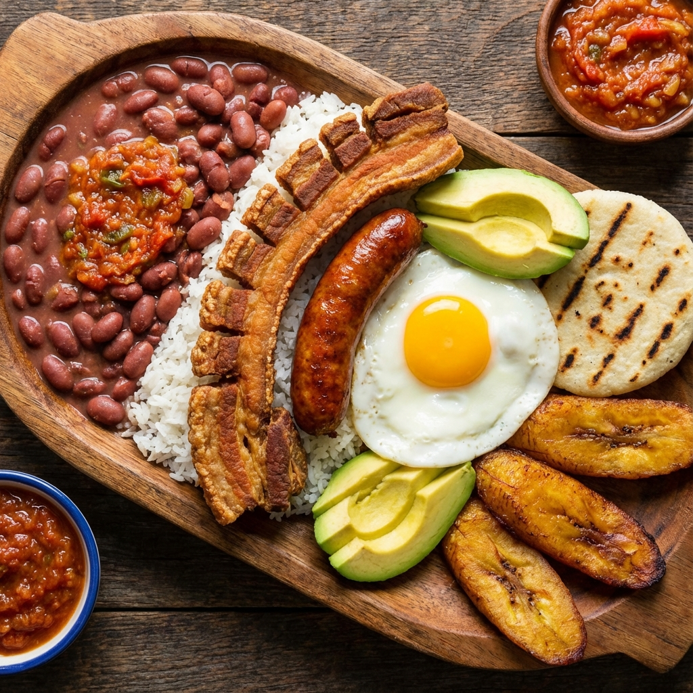
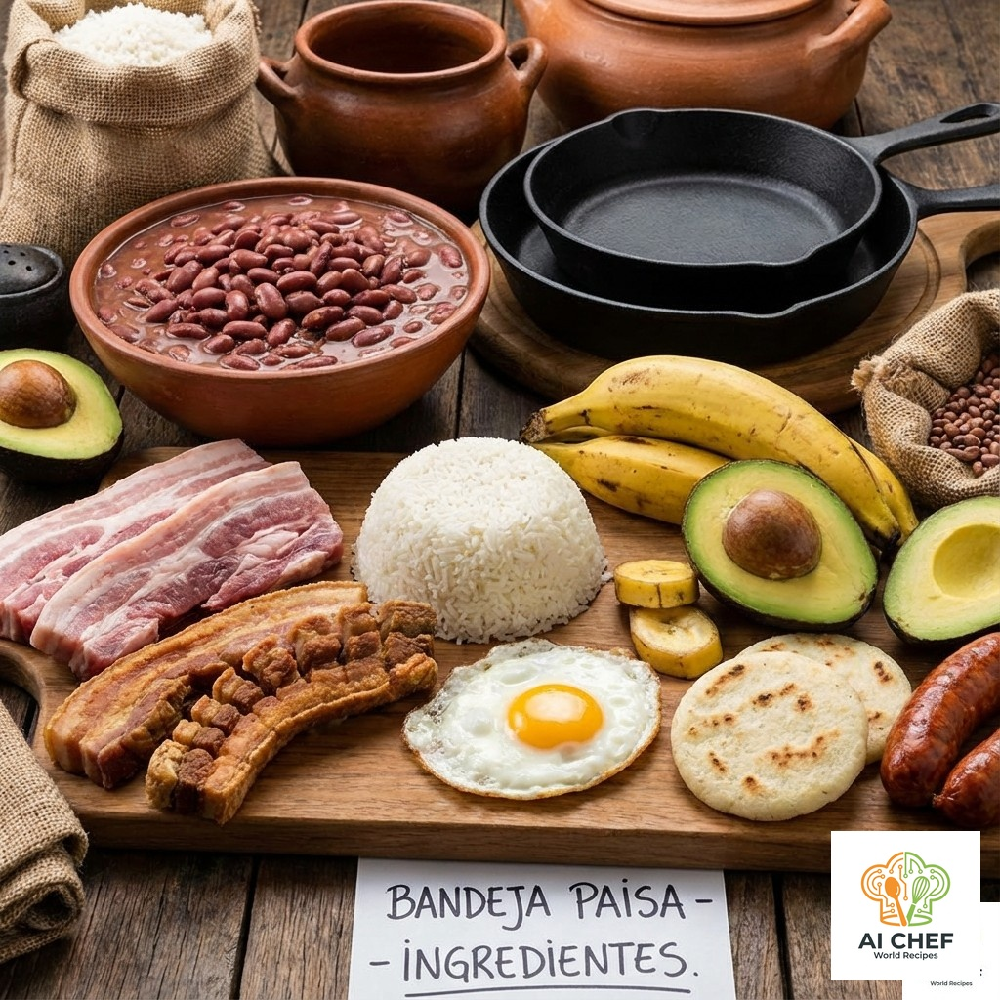

## 🍲 Bandeja Paisa

La Bandeja Paisa es el plato más emblemático de la región andina de Colombia, especialmente de Antioquia. Es una comida abundante y deliciosa, perfecta para compartir y disfrutar de una explosión de sabores tradicionales.

## Información General

* **Dificultad:** ★★★★☆
* **Tiempo de preparación:** 30 minutos
* **Tiempo de cocción:** 2 horas
* **Porciones:** 4

---

## 📝 Ingredientes

* **Para el plato principal:**
    * 500 g de carne molida (cocida)
    * 1 taza de arroz blanco (cocido)
    * 1 taza de frijoles rojos (cocidos)
    * 4 plátanos maduros
    * 4 chorizos
    * 4 morcillas
    * 4 huevos
    * 4 arepas antioqueñas
    * 2 aguacates
    * Aceite para freír
    * Sal y pimienta al gusto

* **Para el Hogao (salsa criolla):**
    * 1 cebolla grande, picada
    * 1 tomate grande, pelado y picado
    * 1 diente de ajo, picado

---

## 👨‍🍳 Instrucciones

1. **Plátanos:** Pela los plátanos maduros y córtalos en rodajas gruesas. Fríelos en aceite caliente hasta que estén dorados por ambos lados. Resérvalos en papel absorbente.
2. **Embutidos:** Fríe los chorizos y las morcillas en una sartén hasta que estén bien dorados. Resérvalos.
3. **Hogao y Frijoles:** Para hacer el hogao, sofríe la cebolla, el tomate y el ajo en una sartén con un poco de aceite hasta que la salsa espese. Una vez listo, mezcla el hogao con los frijoles ya cocidos.
4. **Huevos:** En una sartén aparte, fríe los 4 huevos al gusto (con la yema blanda es ideal).
5. **Arepas:** Calienta las arepas en una plancha o sartén hasta que estén ligeramente tostadas.
6. **Calentar:** Asegúrate de que la carne molida, el arroz y la mezcla de frijoles con hogao estén bien calientes antes de servir.
7. **Montaje:** ¡La parte más divertida! En 4 platos o bandejas grandes, sirve generosamente cada uno de los ingredientes: una cama de arroz, los frijoles, la carne molida, el chorizo, la morcilla, las tajadas de plátano, la arepa, medio aguacate en rodajas y, para coronar, el huevo frito. ¡A disfrutar!

---

## 💡 Variaciones y Consejos

* **Chicharrón:** La receta original lleva un buen trozo de chicharrón crujiente. Puedes freír tocino carnudo hasta que quede bien tostado.
* **Adelanta trabajo:** Para que la preparación no sea tan abrumadora, puedes dejar los frijoles en remojo desde la noche anterior y cocinar el arroz con antelación.
* **El orden:** Tradicionalmente, cada ingrediente se cocina por separado para mantener su sabor único. ¡No mezcles todo en una sola olla!

---

## 📸 Galería

---

## 🔬 Análisis Detallado y Sabiduría Colectiva

### 📊 Perfil Sensorial Estandarizado

| Atributo | Descriptor Principal | Intensidad (1-5) | Notas Químicas |
|----------|----------------------|------------------|----------------|
| **Sabor**| Salado, Umami, Graso | 5/5              | Glutamatos (carnes), Sodio (chorizo), Lípidos oxidados (chicharrón). |
| **Aroma**| Ahumado, Cerdo       | 5/5              | Compuestos fenólicos (humo), Aldehídos (grasa frita). |
| **Textura**| Compleja (Mix)       | 5/5              | Crujiente (chicharrón) vs. Cremoso (frijol) vs. Suave (arroz). |
| **Boca** | Recubrimiento Graso  | 5/5              | Alta palatabilidad por la combinación de grasas saturadas y almidones. |

### ⚗️ Química y Física Culinaria

- **Reacción de Maillard & Pirodextrinas:** El **Chicharrón** y el **Plátano Maduro** fritos son ejemplos de manual. En el plátano, los azúcares reductores reaccionan con aminoácidos a >140°C creando colores pardos y sabores a caramelo. En el chicharrón, la piel deshidratada explota por la presión de vapor (ver *Sus scrofa* en ingredientes), creando una estructura de "espuma sólida" crujiente.
- **Emulsificación de Almidón (Frijoles):** Los frijoles rojos (*Phaseolus vulgaris*) liberan amilosa durante la cocción lenta. Al mezclarse con el colágeno de la pezuña (si se usa) y la grasa del hogao, se forma un "potaje" coloidal espeso que cubre el paladar, contrastando con el arroz seco.
- **Contraste de pH:** El chorizo y la morcilla suelen tener un pH ligeramente ácido (por fermentación o vinagre), lo que ayuda a "cortar" la sensación grasa de los fritos, limpiando parcialmente las papilas gustativas.

### 🍎 Nutrición y Metabolismo

- **Calorías Totales:** >1500 kcal/porción (Hipercalórico).
- **Impacto Metabólico:** Carga glucémica extrema y alto contenido de grasas saturadas. Es un plato de "resistencia" diseñado para jornadas laborales agrícolas intensas, no para sedentarismo.
- **Perfil Proteico:** Muy alto (>50g), combinando fuentes animales (huevo, cerdo, res) y vegetales (frijol).
- **Micronutrientes:**
    - **Hierro Hemo:** Alta biodisponibilidad (morcilla, carnes).
    - **Potasio:** Aporte significativo del plátano y aguacate.
- **Bioactivos:** Licopeno (tomate del hogao) y compuestos fenólicos (frijoles oscuros).

### 🕰️ Contexto Socio-Cultural y Saberes Ancestrales

- **Historia y Origen:** La Bandeja Paisa es una evolución moderna (siglo XX) del "Envuelto Antioqueño" que llevaban los arrieros. Era una comida hipercalórica diseñada para sostener largas jornadas de caminata cruzando montañas. Su consolidación como plato turístico "bandeja" ocurren en restaurantes de paso.
- **Saberes Ancestrales:**
    - "El frijol debe ser cargamanto para que *cale* (espese) bien el caldo".
    - "Al chicharrón hay que 'sobarlo' con bicarbonato para que la piel toteé (explote) y quede galleta".
    - Se dice que los 9 ingredientes representan la abundancia de la tierra antioqueña.

### 📚 Estudios y Referencias

1. *McGee, H. (2004).* "On Food and Cooking". (Mecánica de la fritura de piel de cerdo).
2. *Reyes et al.* "Antioxidant capacity of common bean (Phaseolus vulgaris L.) cultivars grown in Colombia".
3. USDA FoodData Central: Pork, cured, bacon.

### Sabores y Consejos de Restaurantes Emblemáticos

- **Maru Rico (Guayabal):** Su versión destaca por el uso de carnes expertamente asadas, con frijoles, arroz, chorizo, morcilla, chicharrón, huevo frito y plátano maduro. El plato es abundante y el sabor de las carnes a la parrilla es protagonista. [Fuente](https://mejoresrestaurantesmedellin.com/bandeja-paisa/)

- **Capital Antioqueña (Laureles):** Ambiente elegante y preparación refinada. Morcilla de sabor delicado, chicharrón perfectamente crujiente, chorizo no graso, carne molida que combina con arroz y frijoles. Destaca el equilibrio de todos los componentes. [Fuente](https://mejoresrestaurantesmedellin.com/bandeja-paisa/)

#### Consejos de la comunidad y comensales

1. **Planificación (Mise en Place):** Cocina los frijoles y el arroz con antelación para no sentirte abrumado.
2. **Frijoles con Sabor:** Cocina los frijoles con ajo y comino desde el inicio para que absorban más sabor.
3. **El Truco del Chorizo:** Para reducir la grasa, hierve los chorizos en agua con sal por 10 minutos antes de freírlos.
4. **Cada Ingrediente por Separado:** Cocina cada componente en sartenes separadas para mantener sus sabores únicos.
5. **Chicharrón Perfecto:** El secreto está en freír a fuego bajo primero para que suelte grasa y luego subir la temperatura para que quede crujiente por fuera y suave por dentro. [Consejo de usuarios en Google Maps: Maru Rico]
6. **Montaje Generoso:** Sirve cada ingrediente por separado en la bandeja, permitiendo que cada comensal combine a su gusto.
7. **Acompañamiento Ideal:** Bebidas como Refajo (cerveza y gaseosa), Aguapanela con limón o jugo de lulo son recomendadas para balancear la contundencia del plato.

---

> **Fuentes consultadas:**
>
> - [Mejor Bandeja Paisa en Medellín 2025: ¡una visita obligada! - mejoresrestaurantesmedellin.com](https://mejoresrestaurantesmedellin.com/bandeja-paisa/)
> - [Top 10 restaurants with bandeja paisa in Medellín - Restaurant Guru](https://restaurantguru.com/bandeja-paisa-Medellin-m7916)
> - [¿Dónde comer la mejor bandeja paisa? Restaurantes típicos en Medellín - dondecelebrar.com](https://dondecelebrar.com/restaurantes-tipicos-en-medellin/)
> - [Opiniones de usuarios en Google Maps y TripAdvisor]
