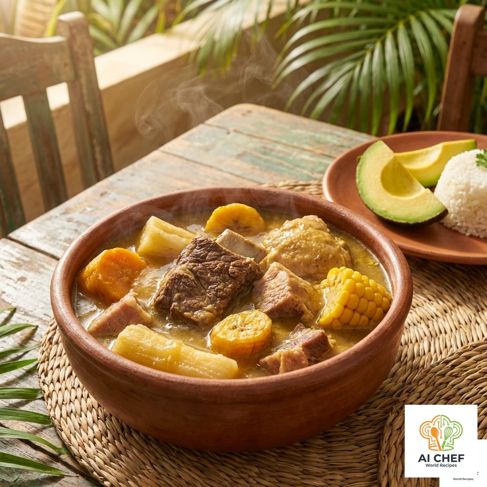

## 📝 Ingredientes

- 1 kg de costilla de res
- 1 kg de pollo (muslos o pechuga)
- 500 g de cerdo (espinazo o costilla)
- 2 mazorcas de maíz tierno
- 2 yucas medianas
- 2 plátanos verdes
- 1 ñame pequeño
- 4 papas criollas
- 1 cebolla cabezona
- 2 dientes de ajo
- 1 pimentón rojo
- 1 manojo de cilantro
- Sal y pimienta al gusto
- Comino al gusto
- Agua suficiente

---

## 👨‍🍳 Instrucciones

1. **Preparar las carnes:** Cocina las carnes en una olla grande con agua, cebolla, ajo, sal y comino hasta que estén tiernas. Desespuma y retira el exceso de grasa.
2. **Agregar tubérculos y verduras:** Incorpora la yuca, papa, plátano, ñame y mazorca. Cocina hasta que estén blandos.
3. **Finalizar:** Añade el pimentón y el cilantro picado. Ajusta la sal y la pimienta.
4. **Servir:** Sirve caliente en platos hondos, acompañado de arroz blanco, aguacate y ají costeño.

---

## 💡 Variaciones y Consejos

* Puedes usar solo pollo, solo res o solo cerdo según la ocasión.
* El ñame es clave para la textura espesa y el sabor auténtico costeño.
* El sancocho tradicional se sirve en reuniones familiares y fiestas patronales.

---

## 📸 Galería

---

## 🔬 Análisis Detallado y Sabiduría Colectiva

### 📊 Perfil Sensorial Estandarizado

| Atributo | Descriptor Principal | Intensidad (1-5) | Notas Químicas |
|----------|----------------------|------------------|----------------|
| **Sabor**| Salado, Umami        | 5/5              | Sinergia de glutamatos (3 carnes) + nucleótidos. |
| **Aroma**| Cárnico, Herbal      | 5/5              | Aldehídos del **[Cilantro](../../ingredients/cilantro)** y terpenos del comino. |
| **Textura**| Espesa, Tropezuda    | 5/5              | Suspensión de almidones de **[Yuca](../../ingredients/yuca_dulce)** y ñame. |
| **Boca** | Untuoso, Llenador    | 5/5              | Grasa emulsionada de la costilla y colágeno disuelto. |

### ⚗️ Química y Física Culinaria

- **La "Trifecta" de Almidones:** El sancocho usa **[Plátano Verde](../../ingredients/platano_verde)** (almidón resistente, estructura), **[Yuca](../../ingredients/yuca_dulce)** (gel translúcido, espesor "chicudo") y Ñame (mucílago, densidad). Esta combinación crea una viscosidad única que no se logra con harina. El ñame, en particular, debe "desbaratarse" para amarrar el caldo.
- **Extracción de Colágeno:** La costilla de res y el hueso de cerdo requieren cocción prolongada en medio húmedo para convertir el colágeno duro en gelatina. Esta gelatina da la sensación pegajosa en los labios (*lip-sticking*) apreciada en un buen sancocho.
- **Sinergia Umami:** Al combinar res (inosinato), pollo y cerdo, se multiplica la percepción de sabrosura (umami) exponencialmente más que usando una sola carne.

### 🍎 Nutrición y Metabolismo

- **Calorías:** Alto (~700-900 kcal). Es un plato completo.
- **Carbohidratos:** Muy alto. Carga de glucógeno masiva por la mezcla de tubérculos + arroz acompañante.
- **Proteína:** Alta y completa (mix de animales).
- **Micronutrientes:**
    - **Potasio:** Abundante en el plátano y tubérculos (excelente para rehidratación/resaca).
    - **Vitamina C:** La **Papa Criolla** y el cilantro crudo aportan algo, si no se oxidan totalmente.

### 🕰️ Contexto Socio-Cultural y Saberes Ancestrales

- **Historia y Origen:** Derivado del *Ajiaco Taíno* (Indígena) y la *Olla Podrida* española. Es el plato de la "Olla Comunitaria" por excelencia; símbolo de unión vecinal y celebración.
- **Saberes Ancestrales:**
    - "El sancocho se menea con cucharón de palo, el metal lo 'pasma' (corta el sabor)".
    - "La carne se sella con limón primero para matar el chuquía (olor fuerte)".
    - "Sancocho sin ñame es sopa de carne". El ñame es el diferenciador costeño clave.

### 📚 Estudios y Referencias

1. *Cartay, R.* "Historia de la alimentación en el Nuevo Mundo".
2. *Dufour, D.L.* "Cyanide content of cassava (Manihot esculenta) cultivars used by Tukanoan Indians". (Contexto sobre yuca dulce vs amarga).
3. *McGee, H.* "On Food and Cooking". (Hidrólisis del colágeno).

## Sabiduría colectiva, trucos y consejos

1. **Ñame espeso:** El ñame es clave para la textura, agrégalo en trozos grandes y deja que se deshaga parcialmente.
2. **Cilantro fresco:** Añádelo al final para preservar su aroma y sabor.
3. **Acompañamiento:** Sirve siempre con arroz blanco, aguacate y ají costeño.

---

## Fuentes consultadas y enlaces

- [Receta tradicional de sancocho costeño - El Tiempo](https://www.eltiempo.com/vida/receta-sancocho-costeno-13580)
- [Google Maps: Opiniones sobre sancocho costeño](https://www.google.com/maps/search/sancocho+costeño)
- [Foro gastronómico colombiano](https://www.gastronomiacolombiana.com/foro/sancocho-costeno)
